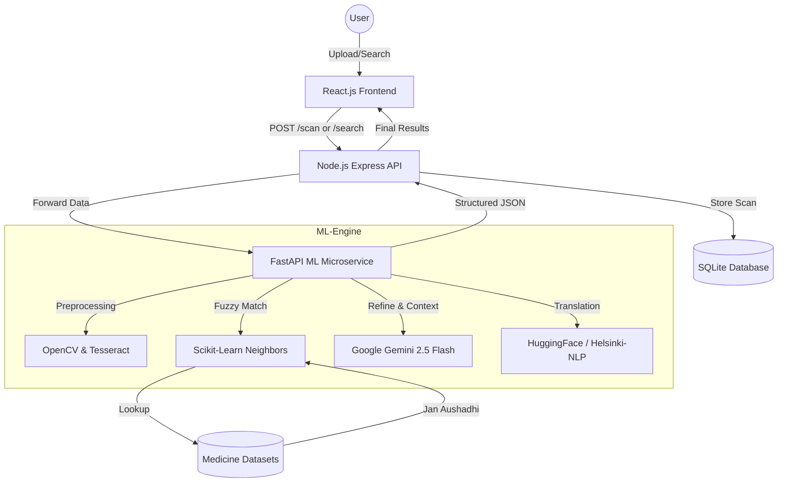

# Medicure Plus — Intelligent Pharmaceutical Analysis

Medicure Plus is a state-of-the-art medical assistant designed to help patients and caregivers understand their medications instantly. By simply scanning a photo of a medicine strip, bottle, or label—or searching by name—the system extracts critical medical information, verifies pricing against Indian government standards (NPPA), identifies Jan Aushadhi generic alternatives, and provides an AI-powered conversational experience in multiple Indian languages.

## 🚀 Key Features

- **📸 Multi-Angle OCR Pipeline**: Custom OpenCV-powered image preprocessing to handle reflective packaging and blur, followed by Tesseract-OCR for high-accuracy text extraction.
- **🔍 Medicine Text Search**: Type any medicine name (e.g., "Crocin", "Amoxicillin") for instant analysis without needing a photo.
- **🧠 ML-Powered Matching Engine**: Uses Scikit-Learn (`TfidfVectorizer` + `NearestNeighbors`) to match OCR tokens against a database of over 250,000 Indian medicines in milliseconds.
- **💊 Deep Medical Context**: Extracts and simplifies Brand Names, Generic Salts, Compositions, Indications, Side Effects, Contraindications, Schedule Types (Schedule H/G), and Storage Instructions.
- **🌐 Multilingual UI & Chat**: Full-page localization support for **English, Hindi, Tamil, Telugu, Bengali, and Marathi** using HuggingFace and Gemini.
- **💰 Price Transparency & Generic Alternatives**: Real-time checking of NPPA ceiling prices and finding cheaper alternatives from the Jan Aushadhi generic dataset.
- **🤖 Vision Fallback**: Automatic routing to Multimodal Gemini 2.5 Flash when traditional OCR confidence is low.

---

## 🏗 High-Level Architecture



---

## 🛠 Tech Stack

- **Frontend**: React.js, Vite, Vanilla CSS, React Icons, Axios, Google OAuth.
- **Backend (API)**: Node.js, Express, SQLite (via `better-sqlite3`), Multer, JWT.
- **ML Microservice**: Python 3.10+, FastAPI, Uvicorn.
- **Computer Vision**: OpenCV, Pytesseract.
- **Machine Learning**: Scikit-Learn (TF-IDF, Nearest Neighbors), Pandas, NumPy.
- **AI Models**: Google Gemini 2.5 Flash, HuggingFace Inference API (Helsinki-NLP).

---

## 📂 Project Structure

- `frontend/`: React source code (reorganized and updated).
- `backend/`: Node.js Express server to handle users, history, and API routing.
- `ml-service/`: Python FastAPI service containing the OCR and LLM pipeline.
- `data/`: Contains the medicine datasets used for training the ML models.
- `scripts/`: Helper scripts for data processing and setup.

---

## ⚙️ Setup & Installation

### 1. Prerequisites
- Node.js (v18+)
- Python 3.10+
- Tesseract OCR (`brew install tesseract`)

### 2. Environment Variables
Sync the `.env` files in both `backend/` and `ml-service/` directories. Use `.env.example` as a template.

**Required Keys:**
- `GEMINI_API_KEY`: Obtain from Google AI Studio.
- `SARVAM_API_KEY`: (Used for HuggingFace Inference Token).
- `GOOGLE_CLIENT_ID`: For Google Login.

### 3. Run the Services
**ML Microservice (Port 8000):**
```bash
cd ml-service
python -m venv venv
source venv/bin/activate
pip install -r requirements.txt
python main.py
```

**Backend (Port 3001):**
```bash
cd backend
npm install
npm run dev
```

**Frontend (Port 5173):**
```bash
cd frontend
npm install
npm run dev
```

---

## ⚠️ Medical Disclaimer
Medicure Plus provides information for educational purposes only. It is **not a substitute for professional medical advice**. Always consult a qualified healthcare provider before taking any medication or changing your dosage.

## 📄 License
MIT License.
