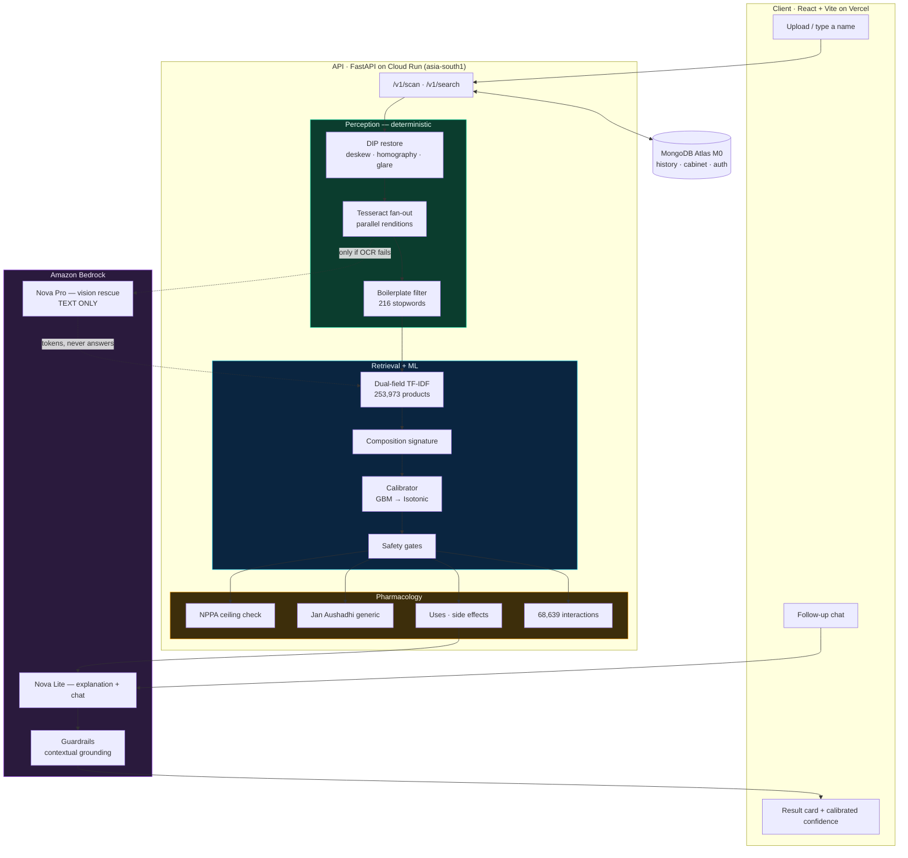
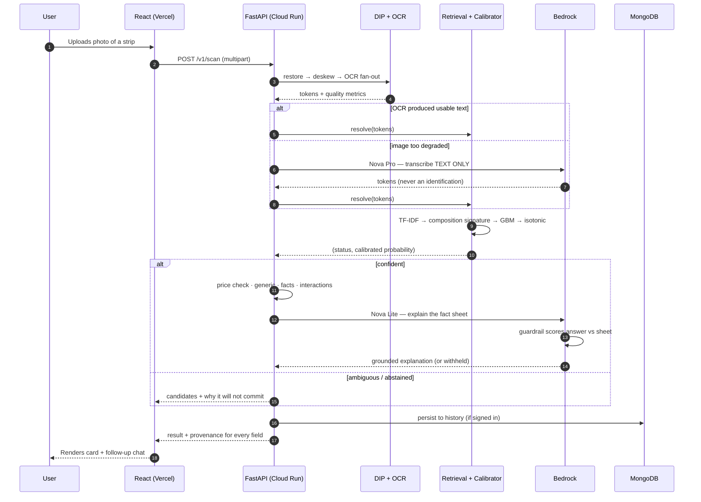
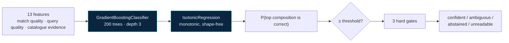
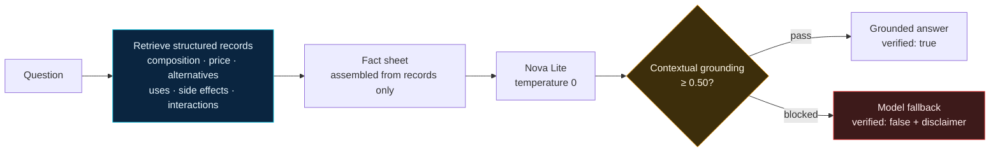
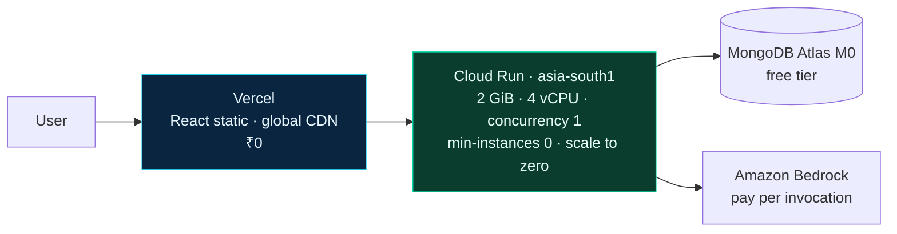

<div align="center">

# MediCure AI

**Photograph a medicine strip. Get an answer that can be checked — or an honest refusal.**

A retrieval-first pharmaceutical intelligence system for the Indian market. It reads a phone photo of
a blister pack, identifies the **composition** against 253,973 branded products, prices it against
NPPA ceilings, finds the Jan Aushadhi generic, checks 68,639 drug-interaction pairs — and attaches a
**calibrated probability** to every identification, so that answers scored 80% are right about 80% of
the time. When the evidence is thin it declines to answer rather than guessing, which on a medicine
is the only defensible behaviour.

[](https://medicure-ai-wheat.vercel.app)
[](https://medicure-api-607129285071.asia-south1.run.app/docs)
[](pyproject.toml)
[](apps/web/package.json)
[](infra/deploy/cloud-run.md)
[](tests/)
[](#deployment--what-it-costs-to-run)

**[Live app](https://medicure-ai-wheat.vercel.app)** · **[API docs](https://medicure-api-607129285071.asia-south1.run.app/docs)** · **[Engineering notes](NOTES.md)** · **[Data sources](data/processed/SOURCES.md)**

`healthcare` · `machine-learning` · `calibrated-confidence` · `rag` · `generative-ai` · `ocr`
`computer-vision` · `information-retrieval` · `tf-idf` · `isotonic-regression` · `scikit-learn`
`amazon-bedrock` · `fastapi` · `react` · `cloud-run` · `pharmacovigilance` · `drug-interactions`
`jan-aushadhi` · `india` · `digital-image-processing` · `abstention` · `medical-safety`

</div>

---

## Table of Contents

- [The Problem](#the-problem)
- [What MediCure Does](#what-medicure-does)
- [The One Rule That Shapes Everything](#the-one-rule-that-shapes-everything)
- [System Architecture](#system-architecture)
- [Request Lifecycle](#request-lifecycle)
- [How Identification Actually Works](#how-identification-actually-works)
  - [1 · Image restoration (DIP)](#1--image-restoration--classical-dip-not-a-model)
  - [2 · Text extraction (OCR + vision rescue)](#2--text-extraction--deterministic-first-model-only-on-failure)
  - [3 · Retrieval (dual-field TF-IDF)](#3--retrieval--dual-field-tf-idf-over-253973-products)
  - [4 · Calibrated abstention (the ML core)](#4--calibrated-abstention--the-ml-core)
  - [5 · Safety gates](#5--safety-gates--three-hard-rules-the-model-cannot-override)
- [Where the ML Is, and Why](#where-the-ml-is-and-why)
- [Where GenAI Is, and Why](#where-genai-is-and-why)
- [Where RAG Is, and Why](#where-rag-is-and-why)
- [The Data Pipeline](#the-data-pipeline)
- [Training and Evaluation](#training-and-evaluation)
- [Benchmarks](#benchmarks)
- [Four Improvements That Measured Worse](#four-improvements-that-measured-worse)
- [Deployment — and What It Costs to Run](#deployment--what-it-costs-to-run)
- [Repository Layout](#repository-layout)
- [Getting Started](#getting-started)
- [API Reference](#api-reference)
- [Testing](#testing)
- [Known Limitations](#known-limitations)
- [Acknowledgements](#acknowledgements)

---

## The Problem

India's pharmaceutical market carries over 250,000 branded products built from a much smaller set of
actual molecules. The same paracetamol 500mg is sold under hundreds of names at prices differing by
an order of magnitude, and a Jan Aushadhi generic with an identical composition is frequently
available at a fraction of the branded price — if you know it exists.

Three things follow, and each is a real harm:

- **Price opacity.** A patient cannot tell whether ₹95 for a strip is fair, or whether an identical
  composition sells for ₹12 two shops away.
- **Look-alike/sound-alike (LASA) confusion.** *Celebrex* and *Celexa* are different drugs.
  Dispensing errors from name confusion are a documented, recurring category of medication harm.
- **Unverifiable answers.** Ask a general-purpose language model to identify a medicine from a photo
  and it will answer fluently, always, including when it is wrong — and its stated confidence is a
  token distribution, not a frequency. A patient has no way to tell which answers to distrust.

The third problem is the one this project is actually about. **An unreliable answer that announces
its unreliability is safe. A wrong answer delivered confidently is not.**

---

## What MediCure Does

| Input | What comes back |
|---|---|
| **Photo of a strip, box or bottle** | Composition, brand, calibrated confidence, price check, cheaper equivalents, Jan Aushadhi generic, uses, side effects |
| **Typed medicine name** | The same, resolved through the same pipeline |
| **A follow-up question** | A grounded answer traced to the retrieved records — or a clearly-labelled unverified one |
| **Two or more medicines** | Interaction check across 68,639 DDInter pairs, plus duplicate-therapy arithmetic |
| **A name you're unsure of** | LASA neighbours — names close enough to be confused at a pharmacy counter |

Every number carries its source. Prices show their arithmetic. Alternatives name the dataset they
came from. And every identification carries a probability that has been fitted on held-out data, not
asserted.

---

## The One Rule That Shapes Everything

> **DIP restores the image. Retrieval identifies the drug. The LLM only explains what was retrieved.**

This is enforced *structurally*, not by prompt instruction. There is no field in the response schema
that a language model is allowed to populate with a fact. The model receives a fact sheet assembled
entirely from retrieved records and is asked to render it in plain English; a contextual-grounding
guardrail then scores its output against that sheet and withholds anything unsupported.

When the databases genuinely do not cover a question, the model *may* answer from its own training —
but that answer is returned with `verified: false`, `source: "model_knowledge"`, and a visible
disclaimer. The user is always told which of the two they are reading.

---

## System Architecture


```mermaid
flowchart TB
    subgraph client["Client · React + Vite on Vercel"]
        UP["Upload / type a name"]
        RES["Result card + calibrated confidence"]
        CHAT["Follow-up chat"]
    end

    subgraph api["API · FastAPI on Cloud Run (asia-south1)"]
        direction TB
        SCAN["/v1/scan · /v1/search"]

        subgraph perception["Perception — deterministic"]
            DIP["DIP restore<br/>deskew · homography · glare"]
            OCR["Tesseract fan-out<br/>parallel renditions"]
            BOIL["Boilerplate filter<br/>216 stopwords"]
        end

        subgraph resolve["Retrieval + ML"]
            IDX["Dual-field TF-IDF<br/>253,973 products"]
            SIG["Composition signature"]
            CAL["Calibrator<br/>GBM → Isotonic"]
            GATE["Safety gates"]
        end

        subgraph enrich["Pharmacology"]
            PRICE["NPPA ceiling check"]
            GEN["Jan Aushadhi generic"]
            FACTS["Uses · side effects"]
            DDI["68,639 interactions"]
        end
    end

    subgraph bedrock["Amazon Bedrock"]
        NPRO["Nova Pro — vision rescue<br/>TEXT ONLY"]
        NLITE["Nova Lite — explanation + chat"]
        GUARD["Guardrails<br/>contextual grounding"]
    end

    DB[("MongoDB Atlas M0<br/>history · cabinet · auth")]

    UP --> SCAN --> DIP --> OCR --> BOIL --> IDX --> SIG --> CAL --> GATE
    OCR -. "only if OCR fails" .-> NPRO -. "tokens, never answers" .-> IDX
    GATE --> PRICE & GEN & FACTS & DDI
    FACTS --> NLITE --> GUARD --> RES
    CHAT --> NLITE
    SCAN <--> DB

    style perception fill:#0b3d2e,stroke:#06d6a0,color:#e8fff7
    style resolve fill:#0a2540,stroke:#22d3ee,color:#e8f7ff
    style enrich fill:#3d2e0b,stroke:#f59e0b,color:#fff8e8
    style bedrock fill:#2a1a3d,stroke:#a855f7,color:#f6ecff
```

**Three decisions worth explaining.**

**Retrieval before generation, always.** The expensive, non-deterministic component (a vision model)
is only reached when the free deterministic path has already failed. On a clean photo, no model is
invoked for identification at all.

**Composition, not brand, is the unit of identity.** Two products with identical signatures *are* the
same medicine regardless of name. This is what makes "find me a cheaper equivalent" a lookup rather
than a judgement call, and it is why the benchmark grades composition rather than brand.

**Concurrency 1 on Cloud Run.** A scan is CPU-bound across a parallel OCR fan-out. Letting a second
request share the container halves the throughput of both. One request per container, 4 vCPU each,
scaling to zero between requests.

---

## Request Lifecycle


```mermaid
sequenceDiagram
    autonumber
    participant U as User
    participant W as React (Vercel)
    participant A as FastAPI (Cloud Run)
    participant D as DIP + OCR
    participant R as Retrieval + Calibrator
    participant B as Bedrock
    participant M as MongoDB

    U->>W: Uploads photo of a strip
    W->>A: POST /v1/scan (multipart)
    A->>D: restore → deskew → OCR fan-out
    D-->>A: tokens + quality metrics

    alt OCR produced usable text
        A->>R: resolve(tokens)
    else image too degraded
        A->>B: Nova Pro — transcribe TEXT ONLY
        B-->>A: tokens (never an identification)
        A->>R: resolve(tokens)
    end

    R->>R: TF-IDF → composition signature → GBM → isotonic
    R-->>A: (status, calibrated probability)

    alt confident
        A->>A: price check · generic · facts · interactions
        A->>B: Nova Lite — explain the fact sheet
        B->>B: guardrail scores answer vs sheet
        B-->>A: grounded explanation (or withheld)
    else ambiguous / abstained
        A-->>W: candidates + why it will not commit
    end

    A->>M: persist to history (if signed in)
    A-->>W: result + provenance for every field
    W-->>U: Renders card + follow-up chat
```

---

## How Identification Actually Works

### 1 · Image restoration — classical DIP, not a model

A phone photo of a blister pack is warped, glare-blown and rotated. A model handed a clipped
highlight cannot recover information that was never captured; a homography can.

| Stage | Technique | Why |
|---|---|---|
| Orientation | 4-way probe (0/90/180/270), scored in parallel | A strip photographed upside down was unreadable *by construction* before 180° was added |
| Deskew | Hough-line angle estimate | A sign error here silently doubles rotation — pinned by a test |
| Perspective | Homography from detected quad | Recovers geometry, not sharpness |
| Glare | Specular detection + inpainting | Foil packaging is a mirror |
| Quality gate | Blur / glare / resolution metrics | Drives abstention: an unreadable photo is a *successful analysis* whose finding is "not enough information" |

The orientation probes and the OCR fan-out both run in parallel. Measured: DIP 4.34s → **1.72s**, OCR
10.1s → **3.1s**, with bit-identical output.

### 2 · Text extraction — deterministic first, model only on failure

**Tesseract runs first**, across multiple renditions of the restored image, fused by corroboration
and confidence. This path is fully deterministic: the same image yields the same tokens, the same
match and the same probability.

**Nova Pro is a rescue, not a default.** It fires on exactly two conditions — the DIP quality gate
judged the image unreadable, or the resolver came back `abstained`/`ambiguous`. Measured on a
crumpled Combiflam strip: Tesseract returned `['by','the','store','mg','away','adults']`; vision
returned `['sanofi','combiflam','ibuprofen','paracetamol']`.

The critical constraint: **vision returns tokens, never answers.** Its output passes through the same
boilerplate filter, the same TF-IDF resolver and the same calibrator as Tesseract's. The model is
never asked "what medicine is this" — only "what characters do you see". The prompt holds it to
transcription so strictly that it returns `NostrosiI` with the OCR-style capital-I typo
*uncorrected*, and `stro-resistant` as the visible tail of "gastro-resistant" *without completing
it*.

A 216-word boilerplate filter then strips packaging furniture — `store`, `directed`, `keep out of
reach of children` — which on a real strip removes ~50% of extracted tokens.

### 3 · Retrieval — dual-field TF-IDF over 253,973 products

Character n-grams (`char_wb`, 2–4) over two fields, because OCR errors are *character*-level and word
tokenisation throws away exactly the signal that survives them.

```
score = max(name_sim, comp_sim) + 0.25 × min(name_sim, comp_sim)
```

`max` because either field alone is sufficient evidence — a legible brand with an unreadable
composition line should still resolve, and vice versa. The `0.25 × min` term rewards agreement
without letting a single strong field be outvoted.

Candidates are then folded to **composition signatures** — a canonical, salt-normalised tuple of
`(ingredient, strength, unit)`. Products sharing a signature are the same medicine.

### 4 · Calibrated abstention — the ML core

This is the component the whole project exists to demonstrate.

A cosine similarity of 0.62 is not a probability. Its meaning depends on how many competitors were
close behind, how long the query was, and how distinctive the match is. Reporting it as "62%
confident" is the mistake this module avoids.


```mermaid
flowchart LR
    F["13 features<br/>match quality · query quality · catalogue evidence"]
    G["GradientBoostingClassifier<br/>200 trees · depth 3"]
    I["IsotonicRegression<br/>monotonic, shape-free"]
    P["P(top composition is correct)"]
    T{"≥ threshold?"}
    GA["3 hard gates"]
    S["confident / ambiguous /<br/>abstained / unreadable"]

    F --> G --> I --> P --> T --> GA --> S
    style G fill:#0a2540,stroke:#22d3ee,color:#e8f7ff
    style I fill:#0a2540,stroke:#22d3ee,color:#e8f7ff
```

**Why isotonic rather than Platt scaling.** Isotonic assumes only monotonicity — a higher score means
more likely correct — rather than imposing a sigmoid the data need not follow.

**The 13 features**, grouped by the question each answers:

| Group | Features | Question |
|---|---|---|
| Match quality | `top_similarity`, `margin`, `margin_ratio`, `second_similarity`, `support`, `candidate_count` | How good is the best candidate, *relative to its rivals*? |
| Query quality | `query_length`, `query_tokens`, `mean_token_length`, `long_token_fraction`, `longest_token`, `has_digits` | Is the question even answerable? |
| Catalogue evidence | `brand_token_coverage` | Is this product in our namespace at all? |

That last feature has a story worth telling, because it is where the interesting engineering was.

`Becosules Capsule` (not in the catalogue) resolved to methylcobalamin + pregabalin at **P=0.4254**.
`Dolo 650 Tablet` — correct, in the catalogue — scored **exactly 0.4254** too. Same isotonic bin, so
no threshold could keep one and drop the other. Match quality couldn't separate them (both matches
are genuinely mediocre); query quality couldn't (both queries are clean English).

What differs is whether the catalogue has *ever heard of* the product: `becosules` appears in none of
253,973 names, `dolo` in many. Adding `brand_token_coverage` as a **GBM feature changed nothing** —
importance 0.0013, drowned by `top_similarity` at 0.52. Applied as a **gate exemption** instead, it
took typed in-catalogue queries from `ambiguous P=0.4258` to `confident P=0.99+`, 8/8.

> **The lesson:** a feature can be highly discriminative and still be useless inside a model that has
> stronger correlates for the same label. Where you apply a signal matters as much as whether you
> have it.

### 5 · Safety gates — three hard rules the model cannot override

Applied *after* the learned probability, because some failures are categorical rather than
probabilistic.

| Gate | Rule | The failure that motivated it |
|---|---|---|
| **Lexical support** | ≥3 word-tokens of 4+ letters, unless brand coverage is high | OCR returned `['x0.035mg','x0.04mg','ree','ore','tens']`. `0.035mg` is the exact strength of ethinyl estradiol — distinctive enough to score 0.575 confident and wrong. No *word* supported the match |
| **Corroboration** | The answer's own composition or brand name must appear in the query | A photographed Crocin strip — PARACETAMOL printed on the foil — was identified as `gelatin solutions` at 80%. "Gelatin" appears nowhere on a Crocin strip |
| **Real-image floor** | Threshold ≥ 0.55 on photographs | The synthetic-fit threshold of 0.473 admitted a confident wrong answer on a real photo, over the line by a thousandth |

The corroboration gate is worth dwelling on because the *first* version of it was wrong. "Does any
query token name something the catalogue knows" leaked on 3 of 5 boilerplate strings — among 253,973
brand names, ordinary words like `store`, `titanium` and `prevent` **are** brand tokens somewhere.
Membership in that vocabulary means almost nothing. Tying the check to *the specific answer being
returned* is what made it discriminating: 12/12 on the same test set.

---

## Where the ML Is, and Why

A fair question for any project that also uses an LLM: what is the machine learning actually *doing*?

| Component | Model | Trained on | What it decides | Could an LLM do this? |
|---|---|---|---|---|
| **Confidence calibration** | GradientBoosting (200×3) → IsotonicRegression | 3,500 synthetic-corruption samples | Whether to answer at all | **No.** An LLM's confidence is a token distribution, not a frequency. It cannot abstain reliably |
| **Retrieval ranking** | TF-IDF `char_wb` 2–4, dual-field | 253,973 product names + compositions | Which compositions are candidates | Not at this latency (62ms) or cost (₹0) |
| **LASA detection** | Damerau-Levenshtein + Jaro-Winkler + Metaphone, thresholds fitted on 4,000 random pairs | Catalogue name space | Which names are confusable | An LLM would *assert* similarity; this *measures* it |
| **Image quality** | Classical blur/glare/resolution metrics | — | Whether to trust the photo | Vision models describe images; they don't quantify recoverability |

The honest framing: **the ML is what makes the system able to say "I don't know."** That is the
entire safety argument. Retrieval finds candidates, and the calibrator decides whether the evidence
justifies showing one — a decision that must be a *frequency* to be meaningful, and therefore must be
fitted on labelled outcomes.

---

## Where GenAI Is, and Why

Three uses, each deliberately narrow, on **Amazon Bedrock** (`us-east-1`).

| Model | Role | Constraint |
|---|---|---|
| **Nova Pro** | Vision rescue — transcription only | Returns tokens; never names a drug. Output re-enters the same resolver |
| **Nova Lite** | Renders retrieved facts into plain English; answers follow-up chat | Temperature 0. May state nothing absent from the fact sheet |
| **Titan Embeddings V2** | Dense retrieval experiment | **Measured and rejected** — see below |
| **Bedrock Guardrails** | Contextual grounding + denied topics | Scores every explanation against its source; withholds unsupported output |

**The guardrail finding worth reporting.** "What are the side effects?" was being *blocked* at a
grounding score of 0.21 while the answer restated the fact sheet almost verbatim — because it
appended *"however, not everyone will experience these"*, a hedge the prompt itself had requested and
which appears nowhere in the source. One self-authored sentence fails the whole answer.

Moving that caveat **into the fact sheet** took the same question from 0.21 (blocked) to 0.99
(passed). Re-measured across all 10 products, every passing score rose:

```
before   0.21  0.22  0.30  0.58  0.61  0.61  0.68  0.78  0.79  0.84
after    0.17  0.25  0.58  0.96  0.98  0.98  0.99  0.99  0.99  0.99
```

The model did not become more careful. Its sentences became **traceable**. The rule that falls out:
*prompts may shape tone; they must not introduce content.*

---

## Where RAG Is, and Why

Retrieval-augmented generation here is unusually strict: the retrieval is *authoritative* and the
generation is *decorative*. A conventional RAG system retrieves passages and lets the model
synthesise. This one retrieves **structured records** and lets the model only phrase them.


```mermaid
flowchart LR
    Q["Question"] --> RET["Retrieve structured records<br/>composition · price · alternatives<br/>uses · side effects · interactions"]
    RET --> FS["Fact sheet<br/>assembled from records only"]
    FS --> LLM["Nova Lite<br/>temperature 0"]
    LLM --> GR{"Contextual grounding<br/>≥ 0.50?"}
    GR -->|pass| OUT["Grounded answer<br/>verified: true"]
    GR -->|blocked| FB["Model fallback<br/>verified: false + disclaimer"]

    style RET fill:#0a2540,stroke:#22d3ee,color:#e8f7ff
    style GR fill:#3d2e0b,stroke:#f59e0b,color:#fff8e8
    style FB fill:#3d1a1a,stroke:#ef4444,color:#ffecec
```

Conversation history is included so follow-ups resolve pronouns ("what about *its* side effects?"),
but **history is never a source**. Only the fact sheet grounds an answer; earlier turns merely
disambiguate the question.

**The grounding threshold was measured, not reasoned.** At 0.70 the filter blocked 5 of 7 attempted
explanations, including a *confident* paracetamol identification — the "teaches nothing except to
turn the guardrail off" failure. 0.50 sits inside a natural gap in the score distribution and passes
8/10 legitimate explanations while still blocking the two that padded a thin fact sheet with the
model's own pharmacology.

---

## The Data Pipeline

| Dataset | Rows | Role | Source |
|---|---|---|---|
| `A_Z_medicines_dataset_of_India.csv` | **253,973** | Brand → composition namespace | Public A–Z Indian medicines dataset |
| `medicine_facts.csv` | **10,270** | Uses, side effects, drug class, habit-forming | Kaggle medicine dataset |
| `interactions.csv` | **68,639** | Pairwise drug interactions | DDInter |
| `master_medicines_final.csv` | **8,233** | NPPA ceiling prices | NPPA gazette compilation |
| `generic.csv` | **2,438** | Jan Aushadhi generics (unbranded, price-controlled) | PMBJP product list |

### Cleaning and transformation: what the data actually required

Raw pharmaceutical data is far messier than its row counts suggest. The transformations that mattered:

**Composition parsing → canonical signature.** Free-text strings like
`"Paracetamol (500mg) + Caffeine (30mg)"` become `(("paracetamol", 500.0, "mg"), ("caffeine", 30.0,
"mg"))`, sorted. This is the join key for equivalence, pricing and alternatives — everything
downstream depends on it being canonical.

**Salt folding.** `amoxycillin` / `amoxicillin`, `cetirizine hydrochloride` / `cetirizine HCl` are
the same molecule written differently. `canonical_ingredient()` folds salt forms and spelling
variants so that a signature comparison is meaningful.

**Exact matching for clinical facts — deliberately not fuzzy.** Fact ingestion joins on *exact*
normalised names. Fuzzy joining was implemented, measured, and **thrown away**: it took 3.2 hours and
was clinically dangerous, because *Celebrex* and *Celexa* are one edit apart and are different drugs.
The cost of exactness is coverage; the cost of fuzziness is a wrong side-effect list. Exact matching
still reached **99.8% catalogue coverage**.

**Boilerplate vocabulary.** A 216-word stopword list built from packaging text, so that `store`,
`directed`, `keep out of reach of children` and excipients like `titanium dioxide` do not become
retrieval evidence.

**Order-independent interaction keys.** `(A,B)` and `(B,A)` must resolve to one record; the lookup is
built on a sorted pair key.

### What the data does *not* support

Stated plainly, because a benchmark that hides this is dishonest:

- **NPPA ceilings are 0% populated** for `nppa_notif`/`nppa_date`. Ceiling prices cannot be *cited*
  to a gazette notification, only compared against.
- **Jan Aushadhi coverage is partial.** Many branded compositions have no generic equivalent in the
  PMBJP list. "No cheaper alternative found" is frequently a *correct* answer, not a bug.
- **The catalogue is prescription-oriented.** Vitamins, supplements and many OTC products —
  Becosules, Revital, Zincovit, Shelcal — are absent entirely and can never be identified, no matter
  how clear the photo.

---

## Training and Evaluation

**Training data is synthesised, deliberately.** Ground-truth pairs of (corrupted OCR text → correct
composition) do not exist as a dataset. They are generated by taking known catalogue entries and
applying a **corruption model** calibrated against real OCR failures — character confusions
(`rn`→`m`, `l`→`1`), dropped characters, truncation, and boilerplate injection — at graded severity.


```mermaid
flowchart LR
    C["253,973 catalogue entries"] --> S["Sample + corrupt<br/>light / moderate / heavy"]
    S --> Q["3,500 (query, truth) pairs"]
    Q --> FE["Extract 13 features"]
    FE --> SP["Train / held-out split"]
    SP --> GBM["GradientBoosting"]
    GBM --> ISO["Isotonic calibration"]
    ISO --> TH["Threshold @ 95% precision"]
    TH --> ART["calibrator.joblib"]

    style GBM fill:#0a2540,stroke:#22d3ee,color:#e8f7ff
    style ISO fill:#0a2540,stroke:#22d3ee,color:#e8f7ff
```

**Held-out results** (`data/artifacts/calibration_report.json`, n = 3,500):

| Metric | Value | Reading |
|---|---|---|
| Accuracy | **0.7077** | Top-1 composition correct, answering everything |
| **Expected Calibration Error** | **0.0092** | Stated confidence is within ~1 point of observed frequency |
| Brier score | **0.0463** | Sharpness *and* calibration together |
| Operating threshold | **0.4731** | Chosen at 95% precision |

**The risk–coverage curve is the real output**, not a single accuracy number:

| Precision target | Threshold | Coverage | Achieved precision | Answered |
|---|---|---|---|---|
| 90% | 0.1404 | **77.6%** | 90.0% | 2,717 / 3,500 |
| **95%** | **0.4731** | **71.6%** | **95.0%** | 2,507 / 3,500 |
| 99% | 0.8980 | **60.3%** | 99.0% | 2,111 / 3,500 |

An ECE of 0.0092 is the claim that matters: **when this system says 80%, it is right about 80% of the
time.** That is checkable, and `eval/bench_identify.py` checks it.

---

## Benchmarks

### Against a raw LLM on identical inputs

Same corrupted queries, one arm with retrieval + calibration, one arm asking Nova to name the
composition directly. Both graded identically on ingredient overlap.

| | MediCure | Raw LLM |
|---|---|---|
| Accuracy (answering everything) | **88.7%** | 84.7% |
| Answered (coverage) | 78.7% | 95.3% |
| Precision when it answers | **99.2%** | 88.8% |
| Abstained | 21.3% | 4.7% |
| **Silent failure — confidently wrong** | **0.0%** | **10.7%** |
| Coverage at 95% precision | **90.7%** | 77.3% |
| Median latency | **62 ms** | 793 ms |

**Zero silent failures against 10.7%** is the result. The LLM is *accurate* — pretending otherwise
would be dishonest — but it answers 95.3% of the time and is confidently wrong on roughly one query
in nine, with no signal a patient could act on.

**Two caveats stated plainly, because the table alone would mislead:**

- **The LLM's ECE is better** (0.118 vs 0.287). MediCure's ECE here is computed against the shared
  *overlap* grading rule while its calibrator was fitted to predict *exact signature* correctness —
  different events. Against what it was actually trained on, ECE is **0.0092**. The two numbers
  answer different questions and neither replaces the other.
- **That zero is "zero on this benchmark", not "zero in the field."** It is measured on synthetically
  corrupted *text*. A real user photograph produced a confident wrong answer that this benchmark
  cannot see — the Crocin case that motivated the corroboration gate.

### On real photographs

| | Phone photos | Web product shots |
|---|---|---|
| Images | 12 | 16 |
| Ingredient hit @1 | **8 / 12 (67%)** | **11 / 16 (69%)** |
| Answered | 10 / 12 | 9 / 16 |
| **Silent failure** | **0 / 12** | **0 / 16** |
| Vision transcription used | 10 / 12 | 14 / 16 |
| Seconds per image | 5.1 | 5.1 |

Scored separately, never pooled — studio product photography is a far easier distribution than a
phone photo of a torn strip, and one averaged number would describe neither.

**The vision path samples, so these numbers move on their own.** The same 28 images have scored 19,
20 and 21 across identical runs. A change worth ±1 here is not a result.

---

## Four Improvements That Measured Worse

Kept in the repository because a negative result that cost a day is worth more than an untested
assumption. Each of these is the "obvious" improvement.

| Idea | Expectation | Measured | Verdict |
|---|---|---|---|
| **Dense retrieval** (Titan V2 embeddings) | Semantic matching beats lexical | top-1 **35.3%** vs lexical **75.3%** | Rejected — brand names are not semantic objects |
| **RRF fusion** (lexical + dense) | Fusion beats either alone | top-1 **73.3%** vs lexical **75.3%** | Rejected — fusion dragged down by the weaker arm |
| **Similarity floor** on matches | Cheap precision win | Would reject **54%** of *correct* answers | Rejected |
| **Narrowing the grounding source** to the clinical section | Smaller source scores better | **0.07** vs 0.21 with the full sheet | Rejected — the filter scores against what it is given |

Dense retrieval failing is the instructive one. `Dytel-Amh` and `Dytor-AM` are visually confusable
strings, not semantically related concepts; an embedding model trained on natural language has no
useful prior over invented brand tokens. Character n-grams model exactly the distortion OCR
introduces.

---

## Deployment — and What It Costs to Run


```mermaid
flowchart LR
    U["User"] --> V["Vercel<br/>React static · global CDN<br/>₹0"]
    V --> CR["Cloud Run · asia-south1<br/>2 GiB · 4 vCPU · concurrency 1<br/>min-instances 0 · scale to zero"]
    CR --> AT[("MongoDB Atlas M0<br/>free tier")]
    CR --> BR["Amazon Bedrock<br/>pay per invocation"]

    style V fill:#0a2540,stroke:#22d3ee,color:#e8f7ff
    style CR fill:#0b3d2e,stroke:#06d6a0,color:#e8fff7
```

| Component | Choice | Monthly |
|---|---|---|
| Frontend | Vercel Hobby | ₹0 |
| API | Cloud Run, scale-to-zero | ~₹8 |
| Database | MongoDB Atlas M0 | ₹0 |
| Bedrock | Nova Lite/Pro, per invocation | ~₹3 |
| **Total** | | **~₹11/month** |

This replaced a design that would have cost **₹1,100–1,400/month**. The savings come from
scale-to-zero and from the architecture itself: because retrieval identifies the drug, the expensive
model is invoked only when the free path fails.

### Five bugs that only appeared in production

A working local checkout hides what the build recipe forgot. Every one of these passed locally:

1. **`$PORT` ignored** — Cloud Run injects it; the container hardcoded 8000.
2. **Calibrator missing from the image** — `.gcloudignore` excluded `data/artifacts/`. The Dockerfile
   now `COPY`s it *and* asserts at build time that it loads and is fitted.
3. **Interactions table excluded** by the same ignore rule.
4. **Unpinned scikit-learn** → `ModuleNotFoundError: No module named '_loss'` from a pickle written by
   a different minor version.
5. **A silent `except Exception`** that turned a startup failure into an empty result.

### Two performance findings that inverted expectations

**Parallel OCR made production *slower*** — 26s → 43s. `os.cpu_count()` reports the *host's* cores,
not the container's cgroup quota, so the pool oversubscribed 4 vCPU with host-count workers. Fixed by
reading `cpu.max` from cgroup v2 and setting `OMP_THREAD_LIMIT=1`.

**1 vCPU returned HTTP 504 on every real photo.** The DIP + OCR pipeline is genuinely CPU-bound; 4
vCPU with `--cpu-boost` brought scans to ~6s.

---

## Repository Layout

```
medicure-ai/
├── apps/
│   ├── api/                    FastAPI service
│   │   ├── main.py             app factory, startup wiring
│   │   └── routers/            scan · search · chat · cabinet · auth · history
│   └── web/                    React + Vite frontend
│       └── src/components/     ResultsDisplay · AskAboutMedicine · ImageUpload
├── packages/
│   ├── perception/             DIP, OCR, orientation, boilerplate, vision transcription
│   │   └── dip/                deskew · homography · glare · quality metrics
│   ├── resolver/               index · normalize · corruption · calibrate  ← the ML core
│   ├── pharmacology/           facts · interactions · lasa · pricing
│   ├── reasoning/              bedrock client · explainer · chat · fallback
│   ├── storage/                MongoDB models
│   └── orchestrator.py         the seam that wires perception → retrieval → reasoning
├── data/
│   ├── processed/              catalogue, facts, interactions, generics, NPPA
│   └── artifacts/              TF-IDF matrices, vectorizers, calibrator.joblib
├── eval/
│   ├── bench_identify.py       vs raw LLM, calibration, risk–coverage
│   ├── bench_photos.py         real photographs, end to end
│   ├── bench_dense.py          lexical vs dense vs RRF
│   ├── bench_guardrail.py      grounding-threshold measurement
│   └── results/                committed benchmark outputs
├── scripts/                    build_index · fit_calibrator · ingest_* · create_guardrail
├── infra/                      Cloud Run deploy, AWS IAM, CDK
├── tests/                      200 tests
└── NOTES.md                    engineering notes and decision log
```

**One file worth calling out: [`packages/resolver/calibrate.py`](packages/resolver/calibrate.py).**
It carries the feature definitions, the training loop, the isotonic fit, the three safety gates — and
extensive comments recording the *measured failure* behind each one, including the exact OCR tokens
that produced them. It is the file to read if you read only one.

---

## Getting Started

### Prerequisites

- Python **3.11+**
- **Tesseract** as a binary on `PATH` — not merely the `pytesseract` wrapper. Without it the
  orientation probes silently return no scores and `tests/test_dip.py` fails as though the code were
  broken.
- An AWS account with **Bedrock** access (Nova Pro, Nova Lite, Titan Embeddings V2) — optional;
  without it, scanning, pricing, alternatives and interaction checks all still work, and only the
  natural-language explanation and chat are disabled.

### 1 · API

```bash
python3 -m venv .venv && source .venv/bin/activate
pip install -e ".[dev]"
brew install tesseract          # or: apt-get install tesseract-ocr
```

```bash
cp .env.example .env            # then fill in AWS + Mongo values
python scripts/build_index.py   # builds TF-IDF matrices from the catalogue
python scripts/fit_calibrator.py
```

```bash
uvicorn apps.api.main:app --reload --port 8000
```

### 2 · Frontend

```bash
cd apps/web && npm install && npm run dev
```

### 3 · Deploy

```bash
bash infra/deploy/deploy-cloud-run.sh
```

See [`infra/deploy/cloud-run.md`](infra/deploy/cloud-run.md) for the full walkthrough, including the
budget alert that keeps this at ₹11/month.

---

## API Reference

Full OpenAPI at **[`/docs`](https://medicure-api-607129285071.asia-south1.run.app/docs)**.

| Method | Endpoint | Purpose |
|---|---|---|
| `POST` | `/v1/scan` | Photo → identification + enrichment |
| `POST` | `/v1/search` | Typed name → the same pipeline |
| `POST` | `/v1/chat` | Grounded follow-up question about one medicine |
| `GET` | `/v1/suggest` | Type-ahead over the catalogue |
| `POST` | `/v1/interactions/check` | Interaction check across a set of medicines |
| `GET` | `/v1/interactions/status` | Coverage of the interaction table |
| `GET` | `/v1/lasa` | Look-alike/sound-alike neighbours for a name |
| `GET/POST/DELETE` | `/v1/cabinet` | Personal medicine cabinet (auth) |
| `GET` | `/v1/cabinet/interactions` | Interactions across the whole cabinet |
| `GET/DELETE` | `/v1/history` | Scan history (auth) |
| `POST` | `/v1/auth/register` · `/v1/auth/login` · `GET /v1/auth/me` | JWT auth |
| `GET` | `/v1/health` · `/v1/metrics` | Liveness and counters |

---

## Testing

```bash
source .venv/bin/activate && pytest -q
```

**200 tests.** The valuable ones warp an image by a known homography and assert recovery, re-measure
deskew output to catch a sign error that would silently double the rotation, assert that a
composition signature is neither too permissive (recommending a different drug) nor too strict (never
finding the generic), and pin every safety gate to the exact OCR tokens that motivated it — including
`test_an_answer_absent_from_the_query_is_never_confident`, which is the Crocin bug.

Benchmarks are separate and reproducible:

```bash
python -m eval.bench_identify --samples 150 --with-llm-baseline
python -m eval.bench_photos --orchestrator
python -m eval.bench_dense --samples 300
python -m eval.bench_guardrail
```

---

## Known Limitations

Stated because a project that hides these is not trustworthy on the things it *does* claim.

- **The catalogue excludes most OTC and supplement products.** Becosules, Revital, Zincovit and
  Shelcal cannot be identified at all. The system abstains, which is correct, but a user may read
  abstention as failure.
- **Vision transcription is non-deterministic.** Temperature is pinned at 0, but Bedrock exposes no
  seed, so the same photo can read `Oflox 200` on one run and `Rivoflox 500` on the next — differing
  in *strength*, which matters clinically. Identification is deterministic whenever Tesseract carries
  the image, and best-effort whenever vision is invoked.
- **The real-image benchmark is 28 images.** Movements of ±1 are noise. Treat the photograph numbers
  as directional.
- **NPPA ceilings cannot be cited** to a gazette notification — see the data section.
- **`eval/results/real_images.json` is stale and unreproducible.** Its corpus was gitignored, never
  committed, and no longer exists; the file carries a `_provenance` block saying so and is kept as a
  record, not a current result.
- **Not a medical device.** Educational and price-transparency use only. Every response carries a
  disclaimer, dosage questions are refused by policy, and nothing here substitutes for a pharmacist.

---

## Acknowledgements

Built on public data: the A–Z Medicines Dataset of India, the DDInter drug-interaction database, the
Pradhan Mantri Bhartiya Janaushadhi Pariyojana product list, NPPA ceiling-price notifications, and a
Kaggle medicine-details corpus. Full provenance in
[`data/processed/SOURCES.md`](data/processed/SOURCES.md).

---

<div align="center">

**[Live app](https://medicure-ai-wheat.vercel.app)** · **[API docs](https://medicure-api-607129285071.asia-south1.run.app/docs)** · **[Engineering notes](NOTES.md)**

*Built by [Adarsh Dwivedi](https://github.com/adarshcod30)*

</div>
